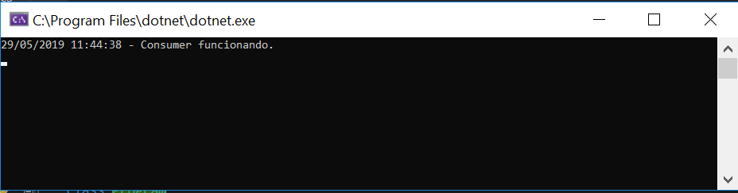
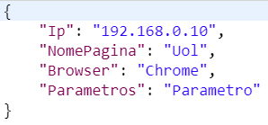
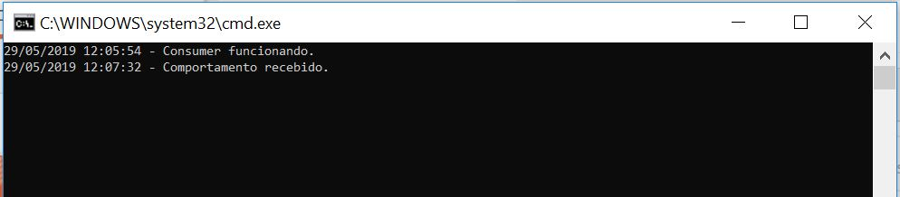

# RabbitMQNetCoreAPI

MqPublisher - Web API que recebe informações referente ao comportamento recebido em pagina Web e adiciona o evento a fila da mensageria
MqConsumer - Host da mensageria que, ao receber evento, adiciona as informações no banco de dados MSSQL e escreve log em documento .csv

## Exemplo de uso

Deverá ser executado o host da mensageria **MqConsumer**

Na Web API, utilizando o caminho **api/Comportamento**, o POST deverá seguir a estrutura do objeto JSON:

Ao receber o evento adicionado à fila pela **Web API**, o **Consumer** notificará o novo evento no console

Gravando os dados no banco de dados e no arquivo csv **C:\Comportamentos.csv**

## Meta

Guilherme Santos – [LinkedIn](https://linkedin.com/in/guilherme-santos-it/) – guilherme.santos97@outlook.com.br

[https://github.com/letsgetithipster/RabbitMQNetCoreAPIComportamentoPaginaWeb](https://github.com/letsgetithipster)

